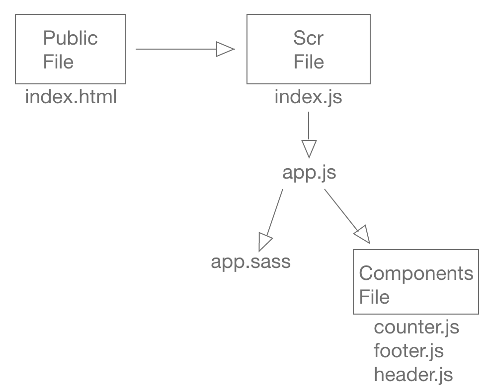

# componentUI

## Author: Adrian Huebner

## Deployable Sites

* [AWS Site](http://lab27reacttesting.s3-website-us-west-2.amazonaws.com/#)
* [Netlify Site](https://condescending-clarke-97efc5.netlify.com/)
* [AWS Amplify](https://master.d16o8maw3iudcd.amplifyapp.com/index.html)

## Tests

### How to Run Tests

  1. Run: `npm run test`
  2. Run: `npm run lint`

## UML

